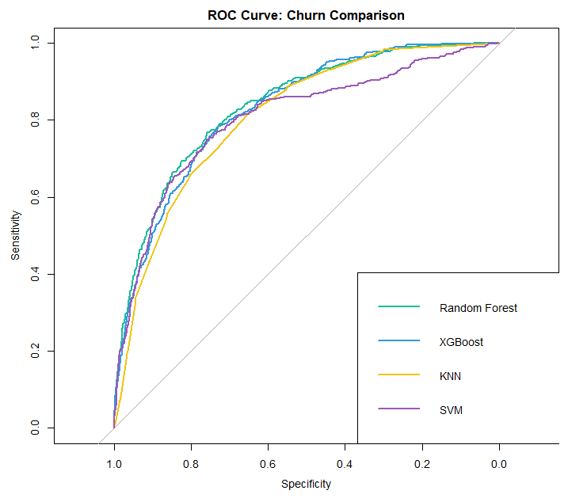
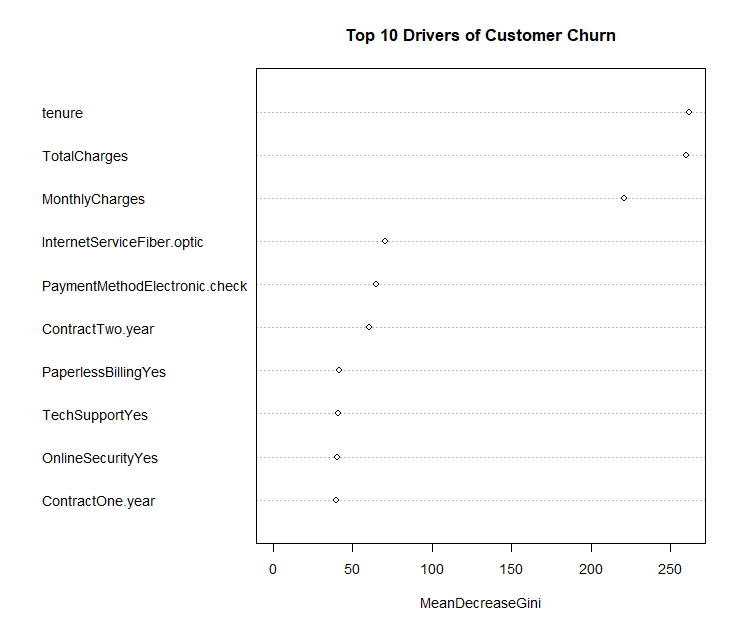

# **Customer Churn Analytics: A Classification ML Non-Parametric Ensemble Study**

## **📌 Executive Summary**

**The Problem:** Customer attrition (churn) is a critical threat to profitability in the telecommunications sector. It is widely estimated that acquiring a new customer costs **5x more** than retaining an existing one. Predicting "at-risk" customers before they leave is essential for targeted retention marketing.

**The Solution:** I developed a predictive framework using **7,043 customer records** to identify high-risk accounts. I implemented a 4-model non-parametric comparison—**Random Forest, XGBoost, K-Nearest Neighbors (KNN), and Support Vector Machines (SVM)**—to capture complex, non-linear patterns in customer behavior that traditional linear models often miss.

**The Result:** * **Top Performance:** **Random Forest** achieved the highest **ROC-AUC (0.8380)** and **Accuracy (80.60%)**, making it the most stable model for overall prediction.

* **Strategic Trade-off:** While Random Forest was the most accurate, **KNN** provided the highest **Recall (54.82%)**. In a business context, high Recall is vital because it ensures the company "catches" more actual churners, even at the cost of some false alarms.

---

## **🛠️ Tech Stack & Libraries**

* **Language:** R
* **Core Libraries:** `tidyverse` (Data Manipulation), `randomForest` (Bagging), `xgboost` (Boosting), `kernlab` (SVM), `caret` (Data Scaling), `pROC` (Model Evaluation).

---

## **📂 Data Description**

The dataset contains 20 features covering demographics, account types, and service usage.

| Variable | Description | Impact |
| --- | --- | --- |
| **Tenure** | Months the customer has stayed with the company | **Primary churn predictor** |
| **TotalCharges** | Total amount charged to the customer | Indicates long-term value |
| **MonthlyCharges** | Current monthly subscription rate | Driver of price-sensitivity |
| **Contract** | Month-to-month, One year, or Two year | High correlation with flight risk |
| **InternetService** | Fiber optic, DSL, or None | Quality of service indicator |
| **PaymentMethod** | Electronic check, Mail, Bank transfer | Operational friction indicator |
| **Churn** | Whether the customer left (Yes/No) | **Target Variable** |

---

## **📈 Non-Parametric Workflow**

### **1. Feature Engineering & Scaling**

Non-parametric models like KNN and SVM are distance-based and highly sensitive to scale.

* **One-Hot Encoding:** All categorical variables were expanded into full-rank dummy variables to ensure the models could process non-numeric traits.
* **Standardization:** I applied **Z-score scaling** to all numeric features. Without this, variables with large magnitudes (like `TotalCharges`) would have unfairly dominated the models over binary flags like `SeniorCitizen`.

### **2. Model Comparison & Results**

I utilized a 70/30 train-test split to validate the generalizability of the algorithms.

| Model | Accuracy | **ROC-AUC** | Precision | **Recall** | F1-Score |
| --- | --- | --- | --- | --- | --- |
| **Random Forest** | **80.60%** | **0.8380** | 67.60% | 51.79% | 0.5865 |
| **XGBoost** | 79.41% | 0.8284 | 63.58% | 52.68% | 0.5762 |
| **KNN** | 78.04% | 0.8103 | 59.38% | **54.82%** | 0.5701 |
| **SVM** | 79.55% | 0.8046 | 67.20% | 45.00% | 0.5390 |

---

## **💡 Business Insights (The "Why")**
### **Feature Importance Ranking**
While ensembles are often considered "black box" models, the **Mean Decrease Gini** metric allows us to rank features based on how much they contribute to the purity of the decision trees.

| Rank | Variable | Importance (Gini) | Business Interpretation |
| :--- | :--- | :--- | :--- |
| 1 | **Tenure** | 261.55 | Long-term loyalty is the strongest deterrent to churn. |
| 2 | **Total Charges** | 259.62 | Cumulative spend indicates deep integration with services. |
| 3 | **Monthly Charges** | 220.69 | High monthly costs are a primary driver for price-shopping. |
| 4 | **Fiber Optic** | 70.62 | Internet type impacts churn; Fiber users may have different expectations. |
| 5 | **Electronic Check** | 64.78 | Payment method friction correlates with higher attrition rates. |
| 6 | **Two-Year Contract** | 60.88 | Long-term commitments significantly stabilize the user base. |
| 7 | **Paperless Billing** | 41.66 | Digital-first customers exhibit different churn behaviors. |
| 8 | **Tech Support** | 40.90 | Access to support is a key factor in service satisfaction. |
| 9 | **Online Security** | 40.83 | Security features act as an "anchor" for customer retention. |
| 10 | **One-Year Contract** | 39.73 | Mid-term contracts provide a moderate buffer against churn. |

Using the **Random Forest Mean Decrease Gini** analysis, I identified the top drivers of churn. This "opens the black box" of the ensemble model to provide actionable advice:

1. **Tenure (Score: 261.5):** The strongest predictor. Customers in their first 6 months are at the highest risk. Retention efforts should focus on "New Customer" onboarding.
2. **Total Charges (Score: 259.6):** High lifetime spend indicates "sticky" customers, whereas low spend coupled with low tenure indicates a high flight risk.
3. **Contract Type (Score: 60.8):** "Month-to-month" users are significantly more likely to churn than those on fixed-year contracts.

---

## **📊 Visual Analytics**

### **1. Model Performance (ROC Curve Comparison)**

*Figure 1: ROC curve illustrating that Random Forest and XGBoost provide superior classification boundaries.*

### **2. Feature Importance Plot**

*Figure 2: Identifying which customer behaviors most strongly lead to a "Yes" for churn.*

---

## **🚀 Conclusion**

By comparing across different machine learning "families"—Bagging (RF), Boosting (XGB), Instance-based (KNN), and Kernel-based (SVM)—I concluded that **Random Forest** offers the most reliable predictions for this dataset. However, for a business that prioritizes "catching every leaver," the **KNN** model provides a higher sensitivity.

**Recommendation:** The company should target month-to-month customers with high monthly charges by offering incentives to switch to long-term contracts, as these are the strongest indicators of imminent churn.
